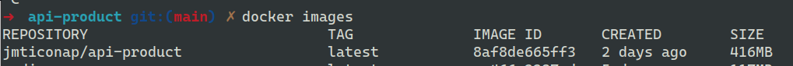
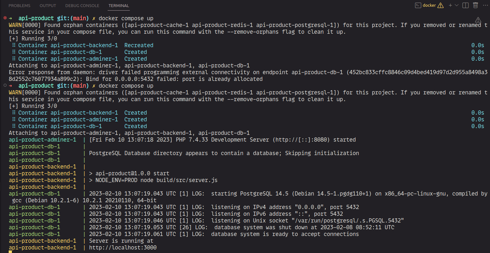

# Product Rest-Api
Simple rest-api for registri of generic products, this is develop with 
NodeJs, ExpressJs, TypeORM, ApiCache, Express-Validator, for testing is
used Jest and Supertest, for the other hand, for the persistance layer
is used PostgreSql with Docker, in the same way for deploy proces is 
implement dockerizing for the rest-api and the compose file for run all
the depends services.

## Dockerizing the App
```shell
docker buil . -t docker_user/api-product
```
For run correctly you have to remplace "docker_user" with your user
of docker, after that you can see the list of images with the following 
command.
```shell
docker images
```

Now we can run.
```shell
docker compose up
```
